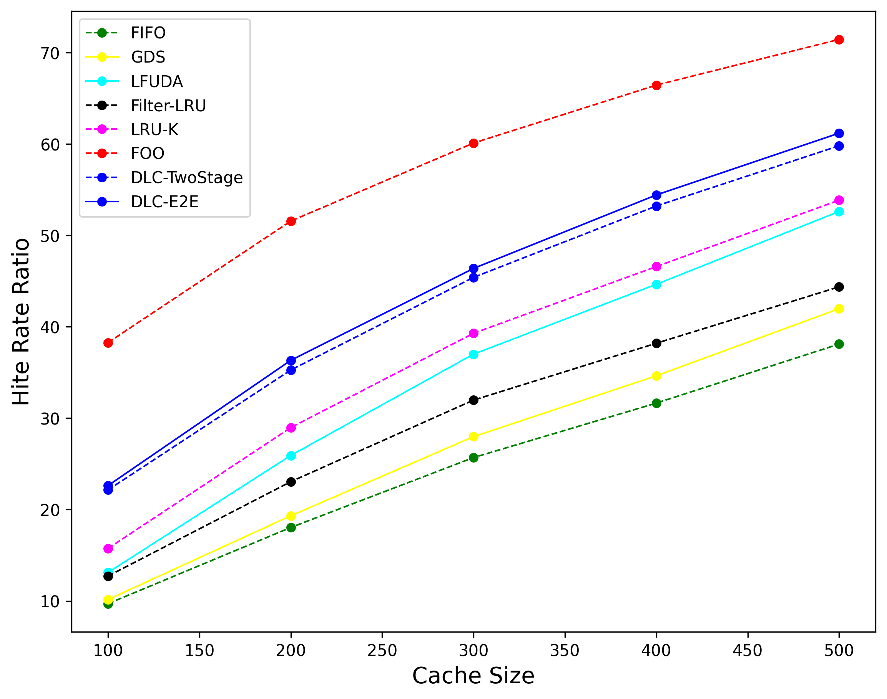

# DLC: Deep Learning Content Caching 的复现以及优化


### A pytorch GPU implementation our accepted paper "End-to-End Deep Learning Proactive Content Caching Framework" at Globecom 2022 CSM


原论文:

E. M. Bakr, H. Ben-Ammar, H. M. Eraqi, S. G. Aly, T. Elbatt and Y. Ghamri-Doudane, "End-to-End Deep Learning Proactive Content Caching Framework," GLOBECOM 2022 - 2022 IEEE Global Communications Conference, Rio de Janeiro, Brazil, 2022, pp. 1043-1048, doi: 10.1109/GLOBECOM48099.2022.10001030.

改进以及优化之处:

使用了更复杂的模型结构（NCF_Att）并且应用了更先进的训练策略（学习率衰减）

使用了GPU加速, 并显示出使用的GPU


## 需要的环境要求:
	* python==3.7
	* pandas==0.24.2
	* numpy==1.16.2
	* pytorch==1.7.1
	* gensim==3.7.1
	* tensorboardX>=1.6 


## 运行数据:
从这儿下载数据:  [link](https://drive.google.com/drive/folders/1Keww2JHH4Pqx_Oe5Q6hp641t-weU2vPd?usp=sharing)
把 "data" 文件夹放在 DLC 文件夹下.

## 运行案例:
```
python main.py
```
也可在 pycharm , 或 Anaconda环境下运行.

### 配置:

所有需要的配置信息已经在 config.py 里配置好了:

    * time_sorting --> If activated we will sort the data based on the time-stamp, otherwise will be distributed to make sure that all the users are represented in each time-interval.
    * rating_th --> Filter data based on sorting. for example remove items that got rating less than 3 to consider positive rating starting from 4 only. If set to zero that means no filtration will occur.
    * window_split --> If set, the data will be split into windows. Otherwise if zero the all data will be used. Please note that this number in thousands.
    * E2E --> E2E: If activated that means we will train the neural network model to directly predict top-k. one stage instead of two stages.
    * modes --> choose whether "training" or "testing".
    * user_item_info --> Use extra info for the user and items while training and testing.

## 以其他内容缓存算法为基准进行比较:



运行其他算法的源码可从以下项目中获取, i.e., FIFO, GDS, FOO , etc.

    * https://github.com/dasebe/webcachesim
    * https://github.com/dasebe/optimalwebcaching

